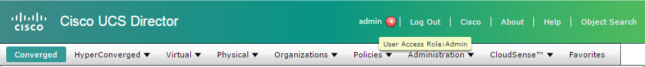
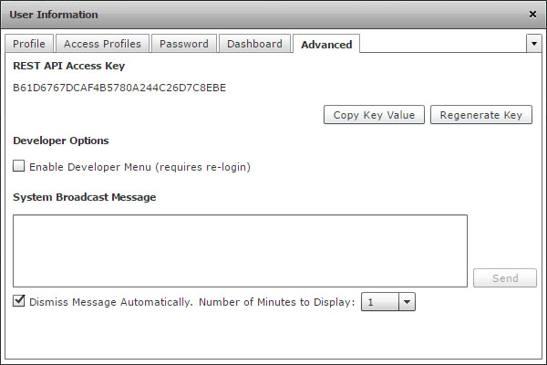
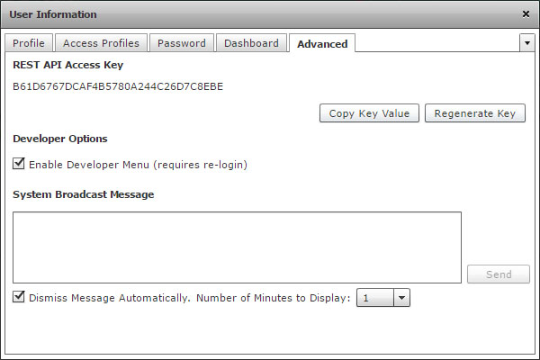
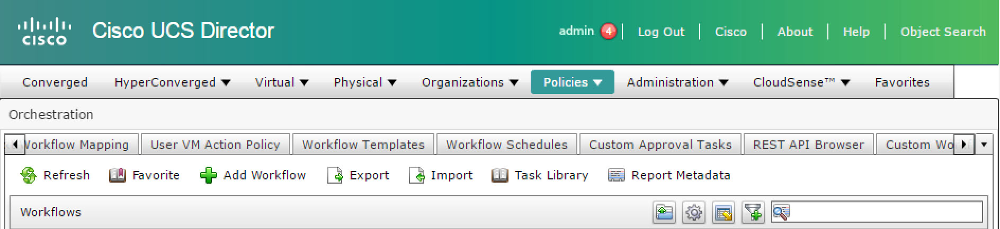
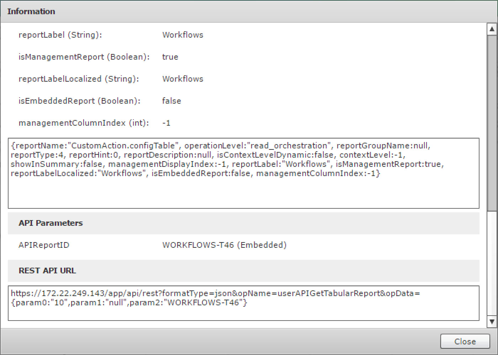
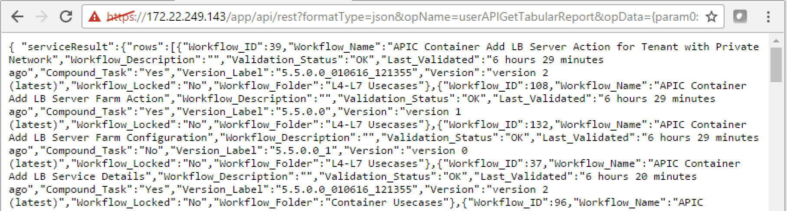
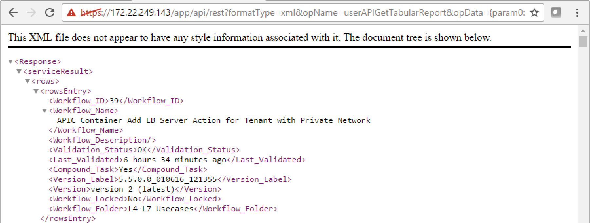

# Introductory UCS Director REST API Part I Cisco DevNet Learning Labs

## Overview
Cisco UCS Director is a complete, highly secure, end-to-end management, orchestration, and automation solution for a wide array of Cisco and non-Cisco data center infrastructure components, and for the industry's leading converged infrastructure solutions based on the Cisco UCS and Cisco Nexus platforms. For a complete list of supported infrastructure components and solutions, see the [Cisco UCS Director Compatibility Matrix](http://www.cisco.com/c/en/us/support/servers-unified-computing/ucs-director/products-device-support-tables-list.html).

Cisco UCS Director is a 64-bit appliance that uses the following standard templates:

  - Open Virtualization Format (OVF) for VMware vSphere
  - Virtual Hard Disk (VHD) for Microsoft Hyper-V

Cisco UCS Director extends the unification of computing and network layers through Cisco UCS to provide you with comprehensive visibility and management of your data center infrastructure components. You can use Cisco UCS Director to configure, administer, and monitor supported Cisco and non-Cisco components. The tasks you can perform include the following:

  - Create, clone, and deploy service profiles and templates for all Cisco UCS servers and compute applications.
  - Monitor organizational usage, trends, and capacity across a converged infrastructure on a continuous basis.
  - Deploy and add capacity to converged infrastructures in a consistent, repeatable manner.
  - Manage, monitor, and report on data center components, such as Cisco UCS domains or Cisco Nexus network devices.
  - Extend virtual service catalogs to include services for your physical infrastructure.
  - Manage secure multi-tenant environments to accommodate virtualized workloads that run with non-virtualized workloads.

## Objective
The objective of this introductory UCS Director REST API learning Lab is to explore the developer resources within UCS Director GUI, to introduce the concept of the REST API Access Key and provide exercises that enable the you to retrieve you user's REST API Access access key, query your user profile and update your password via the UCS Director REST API

Completion time: 30 minutes

## Prerequisites
Prior to starting this learning lab it would be helpful to understand UCS Director and the functionality that it provides.

An understanding of REST APIs and the utiization of Postman REST client, would also be helpful.

## UCS Director REST API
Cisco UCS Director REST API is a language-independent interface that can be used by any program or script capable of making HTTP or HTTPS requests. Use the REST API when you want to invoke operations on Cisco UCS Director from a separate program or process.

Applications can use the REST API to do the following:

Retrieve Cisco UCS Director reports on physical and virtual devices, networks, appliances, groups and users, policies, resource accounting, funds, and other monitored entities within your Cisco UCS domains.

  - Invoke Cisco UCS Director Orchestrator workflow and task operations.
  - Invoke additional operations specific to Cisco UCS Director.

## UCS Director REST API Documentation
There are several programmatic interfaces available for UCS Director this lab focuses on the REST API interface, download the [Cisco UCS Director REST API Getting Started Guide](http://www.cisco.com/c/en/us/td/docs/unified_computing/ucs/ucs-director/rest-api-getting-started-guide/6-0/b_REST_API_Getting_Started_Guide_60.html#reference_3B72657257404E8FAAA0E23904E65DF2) for more detailed inforamtion.

### Event Infrastructure Utilization

### Exercise 1
Find your user's REST API Access key, turn on the developer options, access and utilize "Report Metadata"

  1. Login to UCS Director and click on your username located in the top left of the banner portion of the graphical interface. This will open up your user profile.  In this lab the user is admin.

    

    

  2. There are a number of tabs available, <strong>*click*</strong> on the Advanced

    

    

  3. View your REST API Access key and <strong>*check*</strong> the "Enable Developer Menu (requires re-login)" checkbox. Close the window by

    

    

  4. Logout and login to UCS Director

  5. When logged back in <strong>*click*</strong> on the "Policies" menu then <strong>*click*</strong> on "Orchestration". The resulting screen has a new button "Report Metadata", there is also a new tab "REST API Browser". If you had not previously seen the Orchestration screen then perhaps you would not realize that there is a new button and tab.

    

    

  The REST API Browser tab is a developer tool that will be explored more in Intermediate UCS Director Lab.

  The Report Metadata button appears on almost every UCS Director screen.  The UCS Director screens', row and column layout is considered a report, the Report Metadata shows information (Metadata) about what is displayed on the screen.

  <strong>*click*</strong> on Report Metatdata and scroll to the bottom of the resulting dialog.  You'll see the bottom section is labeled "REST API URL". Pasting the URL into a browser will result in output in the browser as long as your REST API Access Key is in an HTTP header

    

    

  6. Copy the URL from the REST API URL section, open a new browser tab and paste in the URL and "run" (hit enter) the report. The returned information is in JSON format.

    

    

  7. In the URL there is a parameter "formatType" set equal to "json", change "json" to "xml" so that the section of the URL looks like this "formatType=xml". Now "rerun" (hit enter) the report and view that the output is now in XML format.

    

    

  This is the end of Exercise 1
