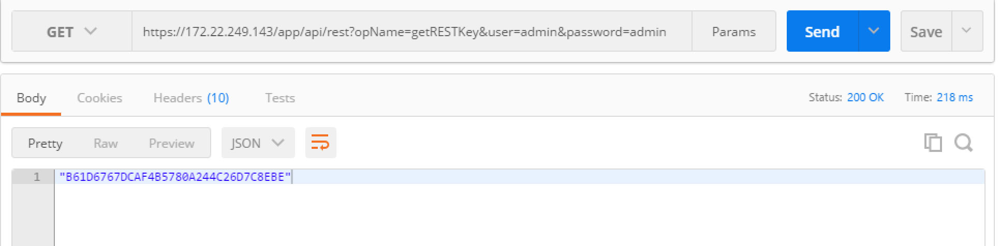
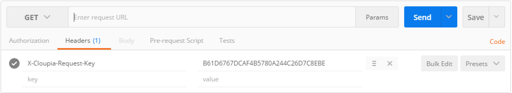
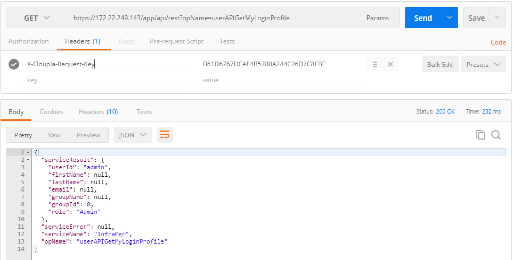
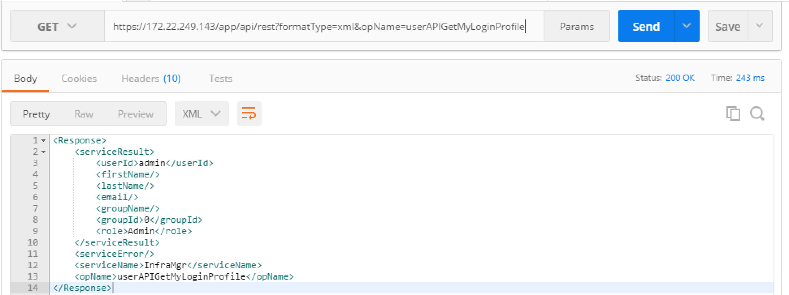
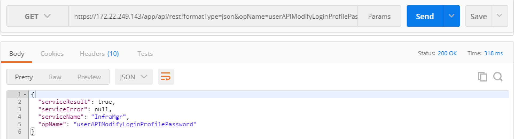
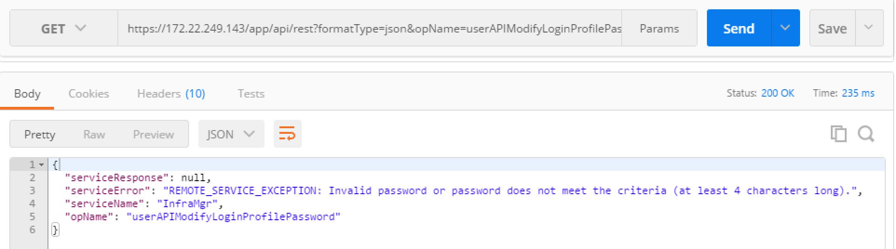
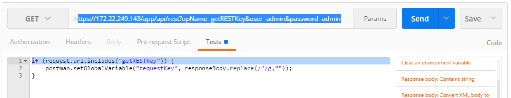
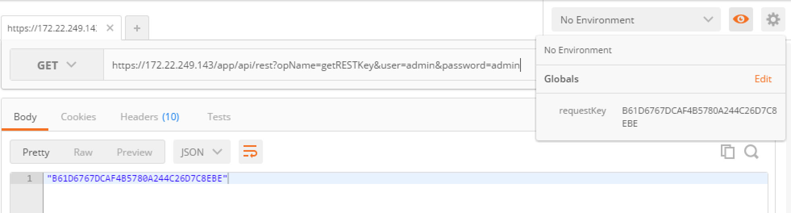
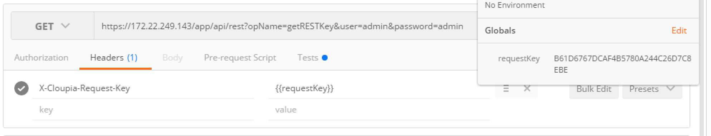

# Introductory UCS Director REST API Part I Cisco DevNet Learning Labs

### Exercise 2
Retrieve your REST API Access Key via the REST API. Retrieve your user profile via the REST API.

  This exercise and many others in the UCS Director REST API lab series will make use of a REST API Client to issue the REST API calls. Specifically Postman is utilized, while other REST API clients will work some exercise will utilize capabilities of Postman that may not exist in other REST API clients. Utilizing Postman is recommended.

  1. In the Postman interface issue a "Get" with the following URL

  `https://<ucsd-ip>/app/api/rest?opName=getRESTKey&user=admin&password=admin`

  Be sure to replace `<ucsd-ip>` with the IP Address of your UCS Director, the `user` value with your username and the `password` value with your password. The UCS Director REST API Access Key will be returned.

  <br/><br/>

  <br/><br/>

  2. Copy the REST API Access Key and create a header for future REST API requests. The header name is "X-Cloupia-Request-Key" set the value to the retuned REST API Access Key.

  <br/><br/>

  <br/><br/>

  3. With the REST API Access Key now available as a header, successive calls to the UCS Director REST API will authenticate utilizing the X-Cloupia-Request-Key. Try retrieving your user profile using the REST API call userAPIGetMyLoginProfile.

  `https://<ucds-ip>/app/api/rest?opName=userAPIGetMyLoginProfile`

  ```json
  {
  "serviceResult": {
    "userId": "admin",
    "firstName": null,
    "lastName": null,
    "email": null,
    "groupName": null,
    "groupId": 0,
    "role": "Admin"
  },
  "serviceError": null,
  "serviceName": "InfraMgr",
  "opName": "userAPIGetMyLoginProfile"
  }```

  <br/><br/>

  <br/><br/>

  The returned data is in JSON format, that is the default format for UCS Director REST API, however XML could have been specified. Notice that the formatType was not specified in the URL, only opName.  UCS Director REST API URLs have three possible parameters

    - formatType - {json|xml}
    - opName - the REST API Operation
    - opData - {param0:"name",param1:"state",paramN:0}

    opName is always required, opData is only required when the operation requires data and formatType is only required when a format other than JSON is required.

  4. Try adding formatType=xml to the last call.

  `https://<ucds-ip>/app/api/rest?formatType=xml&opName=userAPIGetMyLoginProfile`

  <br/><br/>

  <br/><br/>

  Notice that the output format is in XML

  Also notice that the operation status was retuned along with the user profile. In this case the serviceError was "null" so a success.

This is the end of exercise 2.

### Exercise 3
Change you password via the REST API

  1. Use the userAPIModifyLoginProfilePassword to change the password of the currently logged in user. This REST API call requires `opData` to complete the task.

  `https://<ucds-ip>//app/api/rest?formatType=json&opName=userAPIModifyLoginProfilePassword&opData={param0:{"oldPassword":"old-password",
"newPassword":"new-password"}}`

  The opData parameter is a json structure with a single param# specification.

  <br/><br/>

  <br/><br/>

  For this operation only status was returned, indicating success or failure.

  You can specify the same password for the old anfd new password, the REST API will not complain.  However if you specify a blank password for the new password an error will be returned indicating that the new password must be at least 4 characters in length.

  2. Specify a blank password in the new-password portion of the opData.

  `https://<ucds-ip>//app/api/rest?formatType=json&opName=userAPIModifyLoginProfilePassword&opData={param0:{"oldPassword":"old-password",
"newPassword":""}}`

  <br/><br/>

  <br/><br/>

  An error should have been returned.

  ```json
  {
  "serviceResponse": null,
  "serviceError": "REMOTE_SERVICE_EXCEPTION: Invalid password or password does not meet the criteria (at least 4 characters long).",
  "serviceName": "InfraMgr",
  "opName": "userAPIModifyLoginProfilePassword"
  }```

This is the end of exercise 3

### Exercise 4
Extract the REST API Access Key to a Postman global variable

  Postman has a mechanism for running a "Pre-request Script" and post request "Tests"

  These features can be used in conjustiong with saved requests and environments to enable chaining of Postman requests where output from one request can be used as input to another request.

  1. For this exercise you'll add a Test to the `getRESTKey` API call to create a global Postman variable called `requestKey`.

  `https://<ucsd-ip>/app/api/rest?opName=getRESTKey&user=admin&password=admin`

  With the above REST API call in the Postman Get request, click on "Tests" and enter the code below in the "Tests" region.

  ```javascript
  if (request.url.includes("getRESTKey")) {
      postman.setGlobalVariable("requestKey", responseBody.replace(/"/g,""));
  }
  ```
  The above code will create/update the global variable `requestKey` only when the opName `getRESTKey` is in the request URL

  <br/><br/>

  <br/><br/>

  2. <strong>*click*</strong> Send, then view the global variables by <strong>*clicking*</strong> on the `eye` icon. View that the global variable `requestKey` is set to the returned REST API Access Key.

  <br/><br/>

  <br/><br/>

  3. Create a header for "X-Cloupia-Request-Key" and set the value to `{{requestKey}}` now when a request is run X-Cloupia-Request-Key will be set to the value contained in `requestKey`

  <br/><br/>

  <br/><br/>
