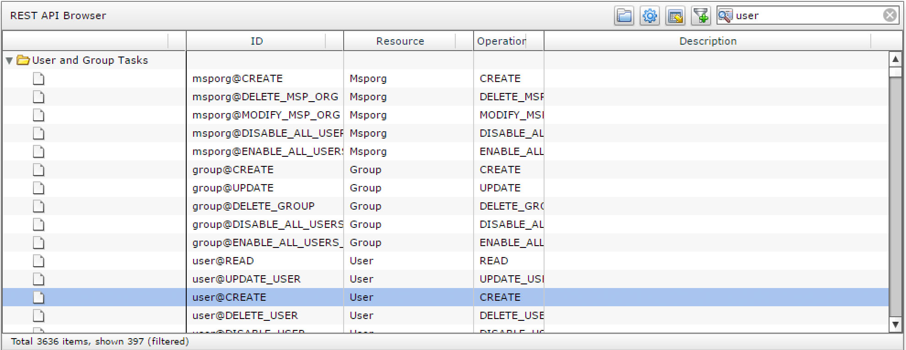
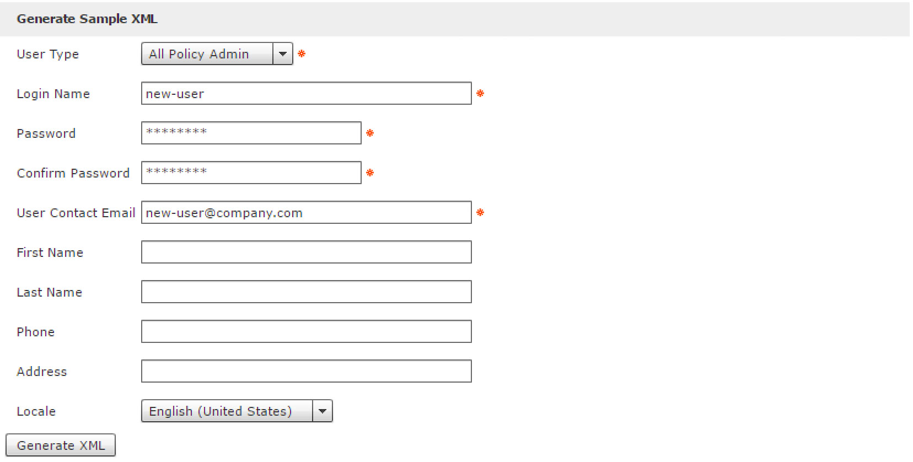
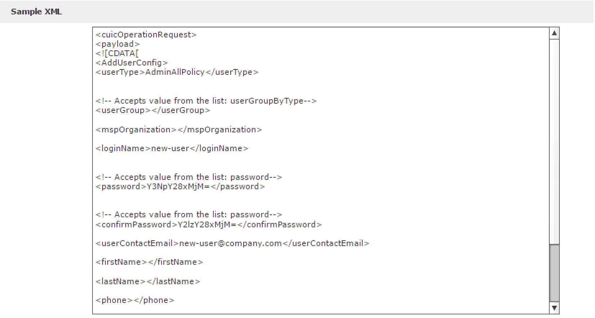
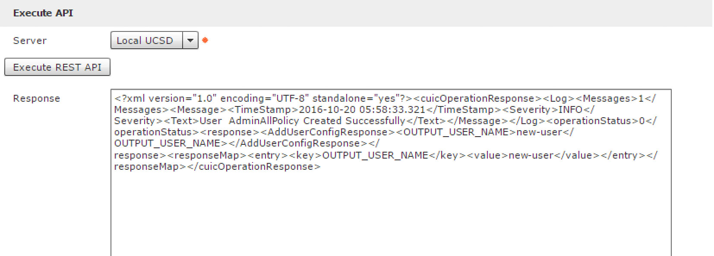
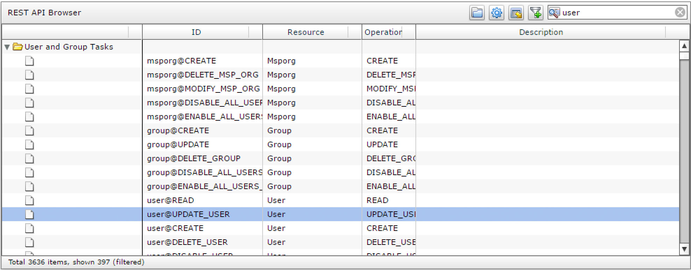
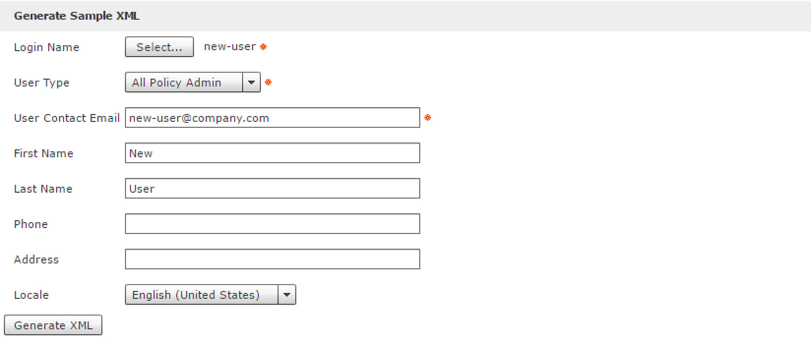
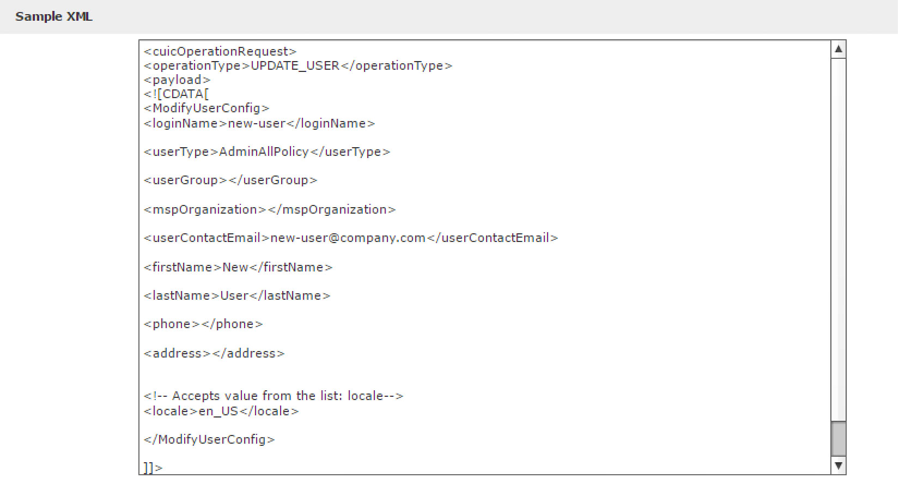
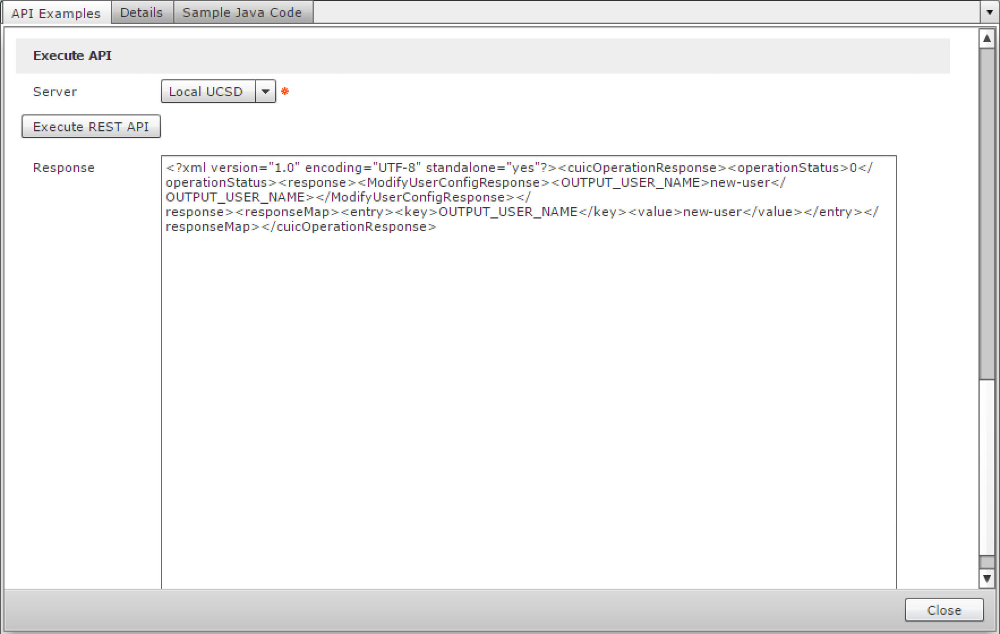
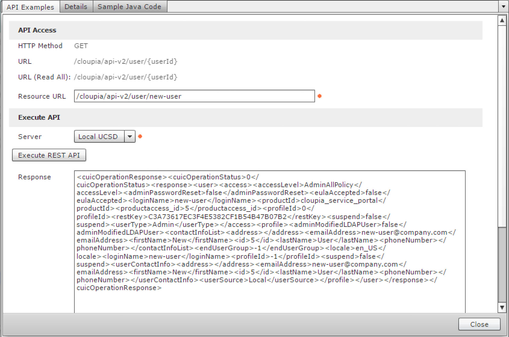
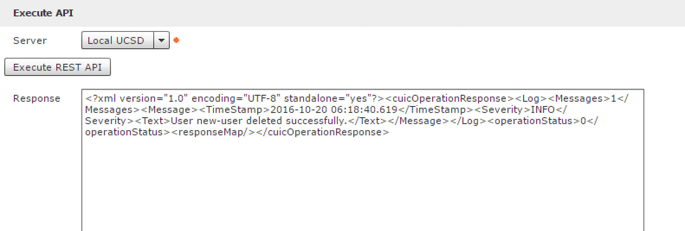

# Introductory UCS Director REST API Part II Cisco DevNet Learning Labs

### Exercise 3
Use the REST API Browser to create, update and delete a user.

  1. <strong>*double-click*</strong> on the task with the "ID" user@CREATE

    

    

  2. Enter the following values

    - Login Name - `new-user`
    - Password - `cisco123`
    - Confirm Password - `cisco123`
    - User Contact Email - `new-user@company.com`

      

      

  3. <strong>*click*</strong> the Generate XML button.

    

    

  4. <strong>*click*</strong> the Execute REST API button.

    

    

  If everything was entered correctly you should see a success message in the Response window. If there was an error with the request then an error would be displayed in the response window.

  5. <strong>*click*</strong> the Close button.

  6. <strong>*double-click*</strong> on the task with the "ID" user@UPDATE_USER

    

    

  7. Enter the following values.

    - Select the user "new-user"
    - First Name - `New`
    - Last Name - `User`

      

      

  8. <strong>*click*</strong> the Generate XML button

    

    

  9. <strong>*click*</strong> the Execute REST API button.

    

    

  10. <strong>*click*</strong> the Close button, <strong>*double-click*</strong> on the task with the "ID" user@READ, add `new-user` to the end of the Resource URL and <strong>*click*</strong> the Execute REST API button. Verify that first name `New` and the last name `User` was updated for the user.

    

    

  11. <strong>*click*</strong> the Close button, <strong>*double-click*</strong> on the task with the "ID" user@DELETE_USER, select the the Login name, <strong>*click*</strong> the Generate XML button, <strong>*click*</strong> the Execute REST API button.

    

    

  View the successful deletion message for user new-user.

  This is the end of exercise 3.

This concludes the lab ucsd-rest-api-102
